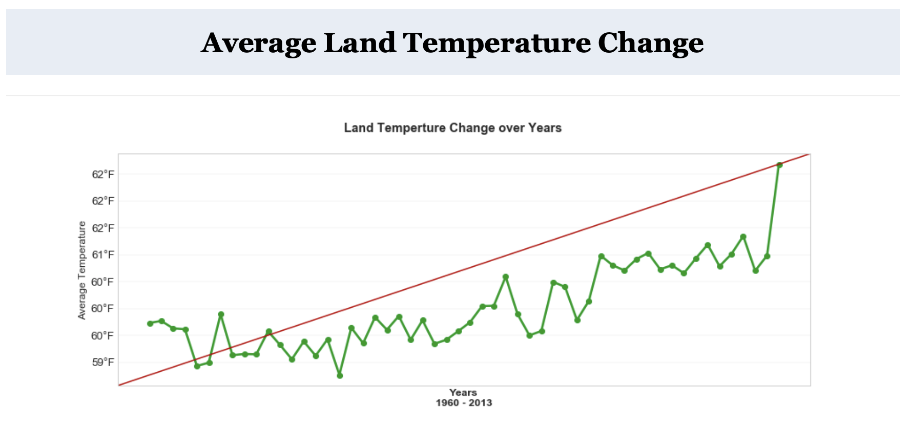
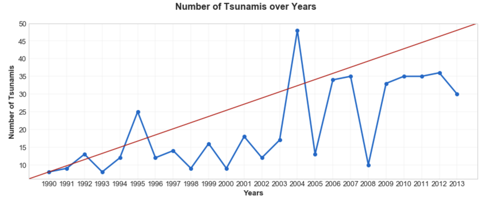
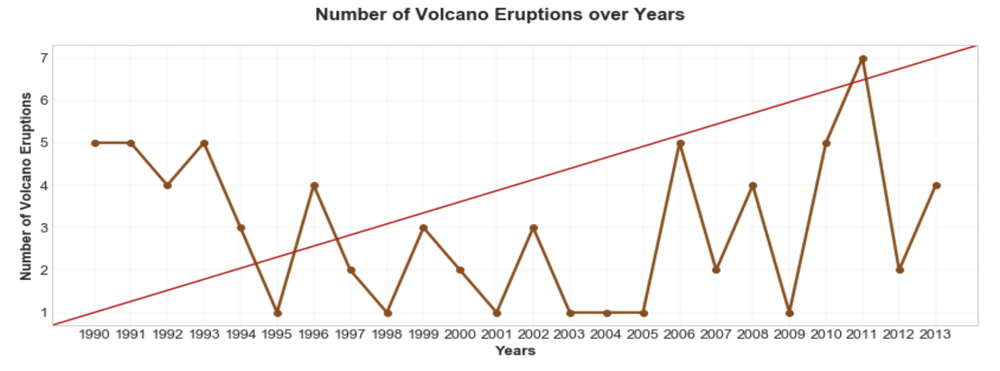
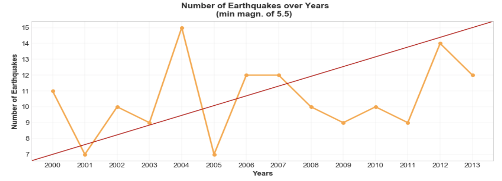
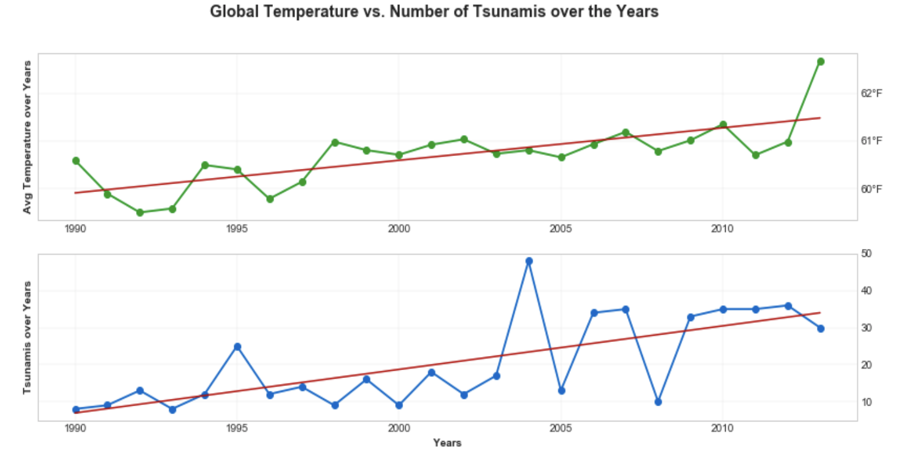
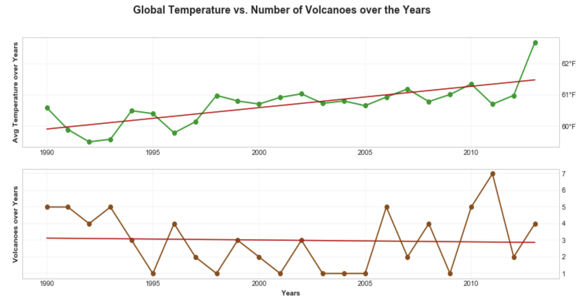
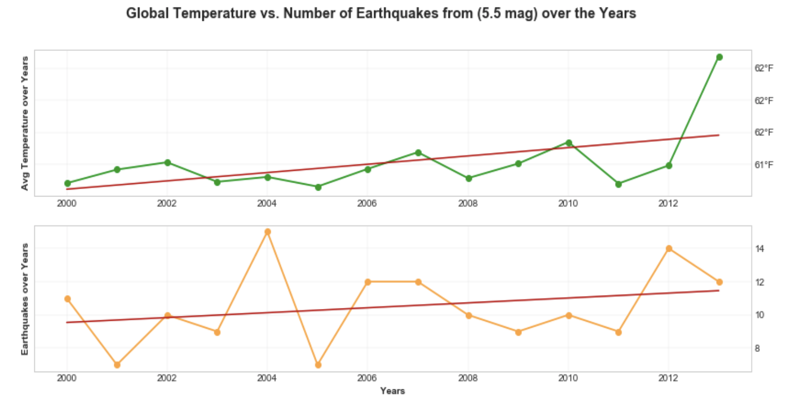

# Natural Disasters Analysis
Group project in which data about natural disasters around the globe were analyzed and results were visualized using Python, Pandas, Matplotlib, JavaScript, D3 and HTML/CSS.
The objective was to analyze if the change in average land temperature has an effect on magnitude of earthquakes, number of earthquakes with magnitudes of 5.5 and higher, number of tsunamis and number of volcanic eruptions. 

## Average Land Temperature Change Over the Years:

The dataset 'GlobalLandTemperatures_ByCountry.csv' was cleaned using Python and Pandas, to extract the average land temperature of specific countries during the years 1960 - 2013. The average land temperature for these countries was plotted against the years to analyze the change over time using Matplotlib. 

## Number of Tsunamis Over the Years:

The dataset 'Historical_Tsunami_Event_Locations.csv' was cleaned using Python and Pandas, to extract the number of tsunamis during the years 1990 - 2014 for several countries around the globe. The results were compared to the change in land temperature during the years 1990-2013. The results were graphed using Matplotlib. 

## Number of Volcanic Eruptions Over the Years:

The dataset 'volcanoes.csv' was cleaned using Python and Pandas, to extract the number of volcanic eruptions during the years 1990 - 2013 for several countries around the globe. The results were compared to the change in land temperature during the years 1990-2013. The results were graphed using Matplotlib. 

## Number of Earthquakes Over the Years:

The dataset 'earthquakes.csv' was cleaned using Python and Pandas, to extract the number of earthquakes during the years 2000 - 2013 with a minimum magnitude of 5.5 for several countries around the globe. The results were compared to the change in land temperature during the years 2000-2013. The results were graphed using Matplotlib. 

## Comparison:

The change in land temperature during the years 1990-2013 was compared to the results found in the previous analyses. The change in land temperature during this period was analyzed against the number of tsunamis during, the number of volcanic eruptions during and the number of earthquakes of magnitude 5.5 and higher during. 

## Comparison of Average Land Temperature and Earthquake Magnitude Using JavaScript and D3:

The datasets ‘GlobalLandTemperatures.csv’and ‘Earthquakes.csv’ were cleaned using Python and Pandas to calculate the average land temperature and the average magnitude of earthquakes during the years 2000 - 2012. This data was selected for the countries Turkey, Iran, Greece and Pakistan and the finalized DataFrames were exported as csv files. 

The comparison between average land temperature and average magnitude of earthquakes was plotted using JavaScript and D3. A scatterplot was created within the temp.js file using JavaScript and D3. The data was pulled from the csv files and the d3.select() function was used to append the graph into the HTML file. CSS was used for both the HTML page styling and the scatterplot styling. D3 was used for animations, transitions, click events on the y labels, and tooltips when the cursor hovers over the state circles.

