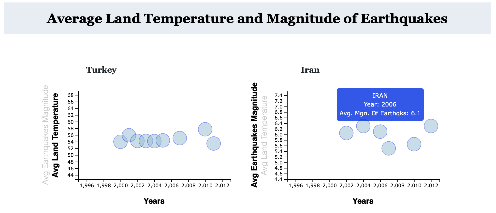

# Natural Disasters Analysis
Group project in which data about natural disasters around the globe were analyzed and results were visualized using Python, Pandas, Matplotlib, JavaScript, D3 and HTML/CSS.

## Comparison of Average Land Temperature and Earthquake Magnitude Using JavaScript and D3:

The datasets ‘GlobalLandTemperatures.csv’and ‘Earthquakes.csv’ were cleaned using Python and Pandas to calculate the average land temperature and the average magnitude of earthquakes during the years 2000 - 2012. This data was selected for the countries Turkey, Iran, Greece and Pakistan and the finalized DataFrames were exported as csv files. 

The comparison between average land temperature and average magnitude of earthquakes was plotted using JavaScript and D3. A scatterplot was created within the app.js file using JavaScript and D3. The data was pulled from the csv files and the d3.select() function was used to append the graph into the HTML file. CSS was used for both the HTML page styling and the scatterplot styling. D3 was used for animations, transitions, click events on the y labels, and tooltips when the cursor hovers over the state circles.

Datasets

GlobalLandTemperatures.csv'

Earthquakes.csv

DATASETS CONTIANING AVERAGE LDN TEMP CLEANED USIG PANDAS AND DATAFRAMES CONTIANING AVERAGE EARTHQAUKE MAGNITUDE NAD AVERAGE LAND TEMP FOR TURKEY, IRAN, GREECE AND PAKISTAN WERE EXPORTED AS CSV FILES. 

 DATA SHOWING AVERAGE LAND TEMPERATURES AND AVERAGE EARTHQUAKE MAGNITUDES FOR COUNTRIES TURKEY, IRAN, GREECE AND PAKISTAN DURING YEARS 2000 - 2013 

Historical_Tsunami_Event_Locations.csv

volcanoes.csv

earthquakes.csv

GlobalLandTemperatures_ByCountry.csv.  1990-2014)

Azerbaijan", "Colombia", "United States", "Italy", "France",
                "Cuba", "Iran", "Egypt", "China", "Turkey", "India", "Russia",
                'Georgia', 'Bulgaria', 'Afghanistan', 'Pakistan', 'Serbia',
                "Mexico", "Japan", "Georgia", "Thailand",
                "Puerto Rico", "Norway", "Indonesia"

General workflow

Questions/conclusions
